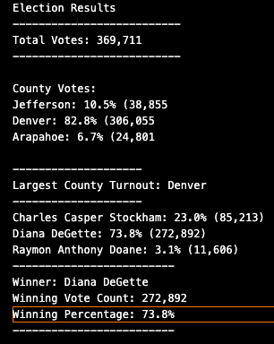

# Election Analysis

## Project Overview

The Colorado Board of Elections has asked me to complete and audit of their local congressional election.

### Audit Tasks

1. Calculate the total number of votes.
2. Compile the list of counties where citzens voted.
3. Compile the list of candidates who recieved votes.
4. Calculate the total number and percentage of votes per county.
5. Determine the county with largest turnout.
6. Calculate the total number and percentage of vote per candidate.
7. Determine the winner of the election based on the popular vote.

## Resources

1. Data: election_results.csv
2. Software: Python 3.8.1, Visual Studio Code 1.45.1

## Results

1. Total Votes
    - 369,711
2. County Names
    - Jefferson
    - Denver
    - Arapahoe
3. Candidates Names
    - Charles Casper Stockham
    - Diana DeGette
    - Raymon Anthony Doane
4. Number and percentage of votes per county
    - Jefferson, 38,855 votes, 10.5% of total votes
    - Denver, 306,055 votes, 82.8% of total votes
    - Arapahoe, 24,801 votes, 6.7% of total votes
5. Largest County Turnout
    - Denver
6. Number and percentage of votes per candidate
    - Charles Casper Stockham, 85,213 votes, 23.0% of total votes
    - Diana DeGette, 272,892 votes, 73.8% of total votes
    - Raymon Anthony Doane, 11,606 votes, 3.1% of votes
7. Winner of congressional election:
    - Diana DeGette

## Summary

This script can be modified to fit other types of election. For example, if you wanted to analyze a congressional election, all you need to do is change the county sections to states. Another example would be if you had a local primary election you would change candidates to in favor or against.

